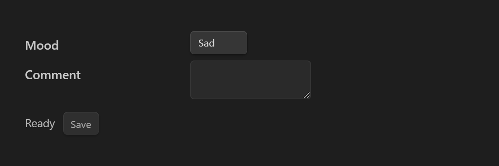
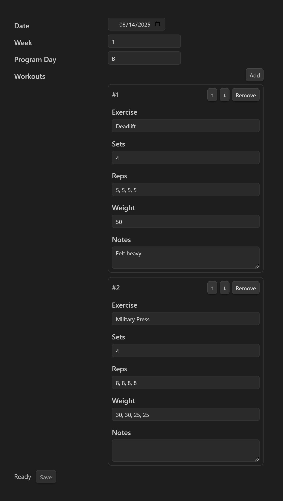

# Archived

Have a look at the [Meta Bind](https://github.com/mProjectsCode/obsidian-meta-bind-plugin) plugin instead, it's a lot more powerful and flexible.

---

# Obsidian YAML Form

Render interactive forms from a YAML schema in your note’s frontmatter and write values back into frontmatter.

## Installation

Currently you can install the plugin in two ways:

1. **Download from Release**
   - Go to the [Releases](./release/) page
   - Download the latest `yaml-form-vX.Y.Z.zip`
   - Unzip into `<vault>/.obsidian/plugins/yaml-form/`
   - Enable in *Settings → Community Plugins*

2. **Using BRAT (Beta Reviewers Auto-update Tester)**
   - Install the BRAT plugin
   - Add this repo URL in BRAT → *Add Beta Plugin*
   - Enable the plugin in your vault

---

## Usage

1. Add a schema under `form:` in your note’s frontmatter.
2. Insert a code block:
   ````
   ```yaml-form
   ```
   ````
   The block will render an interactive form that edits the frontmatter.

---

## Field Types

### Text input
```yaml
---
title: "My entry"
form:
  fields:
    - label: Title
      path: title
      type: text
---
```


### Textarea
```yaml
---
description: ""
form:
  fields:
    - label: Description
      path: description
      type: textarea
      rows: 4
---
```


### Number
```yaml
---
calories: 0
form:
  fields:
    - label: Calories
      path: calories
      type: number
      min: 0
---
```


### Date / Time
```yaml
---
date: 2025-08-29
form:
  fields:
    - label: Date
      path: date
      type: date
---
```


### Select (dropdown)
```yaml
---
category: Lunch
form:
  fields:
    - label: Category
      path: category
      type: select
      options: [Breakfast, Lunch, Dinner]
---
```


### Checkbox (boolean)
```yaml
---
done: false
form:
  fields:
    - label: Done?
      path: done
      type: checkbox
---
```


### CSV Text / CSV Number (arrays of scalars)
```yaml
---
tags: [work, health]
reps: [8,8,6,6]
form:
  fields:
    - label: Tags
      path: tags
      type: csv-text
    - label: Reps
      path: reps
      type: csv-number
---
```


### Repeater (array of objects)
```yaml
---
workouts:
  - exercise: Pushups
    sets: 3
    reps: [10,10,12]
form:
  fields:
    - label: Workouts
      path: workouts
      type: repeater
      itemSchema:
        - label: Exercise
          path: exercise
          type: text
        - label: Sets
          path: sets
          type: number
        - label: Reps
          path: reps
          type: csv-number
---
```
Features:
- Add new items (`Add` button)
- Remove, reorder (↑/↓)
- Inputs expand to full width


---

## Conditional Fields (visibleIf)

You can show a field only if another has a certain value:

```yaml
---
mood: Happy
comment: ""
form:
  fields:
    - label: Mood
      path: mood
      type: select
      options: [Happy, Sad]
    - label: Comment
      path: comment
      type: textarea
      visibleIf:
        path: mood
        equals: Sad
---
```



---

## Autosave

Set globally in plugin settings or per note:
```yaml
form:
  autosave: true
```
With autosave on, all changes write back immediately. Otherwise, use the **Save** button.

---

## Advanced Example: Workout Log
```yaml
---
date: 2025-08-14
week: 1
program_day: B
workouts:
  - exercise: Deadlift
    sets: 4
    reps: [5,5,5,5]
    weight: [50]
    notes: "Felt heavy"
  - exercise: Military Press
    sets: 4
    reps: [8,7,8,8]
    weight: [30,30,25,25]
    notes: ""
form:
  fields:
    - label: Date
      path: date
      type: date
    - label: Week
      path: week
      type: number
    - label: Program Day
      path: program_day
      type: text
    - label: Workouts
      path: workouts
      type: repeater
      itemSchema:
        - label: Exercise
          path: exercise
          type: text
        - label: Sets
          path: sets
          type: number
        - label: Reps
          path: reps
          type: csv-number
        - label: Weight
          path: weight
          type: csv-number
        - label: Notes
          path: notes
          type: textarea
---
```


---

## Roadmap
- Support for external/shared schemas
- Settings UI for global defaults

---

## Contributing
PRs welcome! Please open an issue first if you’d like to discuss a feature.


